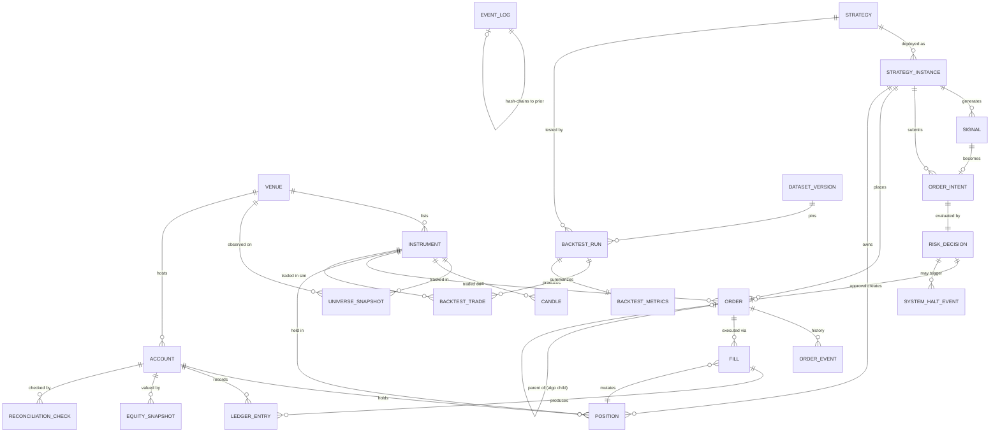

# MVP Database Design — QuantTrade Platform

## Scoping Notes

Two scoping notes precede the schema itself, since the standalone MVP document was never finalized as a separate artifact:

1. **This design uses architecture §2.3 as the MVP definition** — "MVP = every P0 feature." That's the only MVP scope that has actually been defined and approved so far.
2. **Two tables below are Must-Have despite their source feature being tagged P1** in the feature register: `UniverseSnapshot` (D-07) and the backtest run registry (`BacktestRun`/`BacktestMetrics`, B-09). The architecture document itself overrides the priority tag for these two — §11.1 says universe capture "must start on day one" because the data is unrecoverable later, and §12.6 calls the run registry "non-negotiable... build it before you have anything to hide from yourself." These are treated as binding instructions, not as scope creep. Everything else below is strict P0.

One permanent exclusion, not a deferral: there is **no `RiskLimitConfig` table**. §10.1 is explicit that limits are config-as-code, versioned in the repo, never a mutable database row anyone can `UPDATE`. Building that table would be a quiet architectural reversal, so it was not included.

Conceptual model only. No SQL, no engine-specific syntax. 23 entities, grouped by subsystem.

## Entity Summary

| # | Entity | Subsystem | Why It's Must-Have for MVP |
|---|---|---|---|
| 1 | Venue | Reference | Anchors every instrument/order to a counterparty |
| 2 | Instrument | Reference | Trading rules; sealed asset-class seam (§3.8.1) |
| 3 | UniverseSnapshot | Reference | Anti-survivorship-bias capture (day-one, per §11.1) |
| 4 | Candle | Market Data | Only data strategies/backtests actually consume |
| 5 | Strategy | Strategy | Code identity — `code_hash` for reproducibility |
| 6 | StrategyInstance | Strategy | Deployed, parameterized, budgeted unit |
| 7 | Signal | Strategy | Pre-sizing opinion; root of the audit chain |
| 8 | OrderIntent | Risk | Post-sizing, pre-risk trade request |
| 9 | RiskDecision | Risk | Synchronous approve/reject verdict (SC-7) |
| 10 | SystemHaltEvent | Risk | Kill-switch/halt audit trail (SC-8) |
| 11 | Order | Execution | Idempotent order-of-record (`client_order_id`) |
| 12 | OrderEvent | Execution | Replayable state history |
| 13 | Fill | Execution | Exactly-once execution record |
| 14 | ReconciliationCheck | Execution | Proves SC-6 (drift = 0) actually ran |
| 15 | Account | Portfolio | Top-level cash/position/equity container |
| 16 | Position | Portfolio | Current holdings, independently derivable |
| 17 | LedgerEntry | Portfolio | Double-entry cash/position movements |
| 18 | EquitySnapshot | Portfolio | Equity curve / drawdown input |
| 19 | EventLog | Audit | Immutable, hash-chained, ultimate source of truth |
| 20 | DatasetVersion | Backtest | Pins exactly which data a run used |
| 21 | BacktestRun | Backtest | Every run logged — the anti-overfitting registry |
| 22 | BacktestTrade | Backtest | Simulated blotter for tearsheets |
| 23 | BacktestMetrics | Backtest | Summary numbers, incl. DSR trial count |

## Entity-Relationship Diagram

`EVENT_LOG` deliberately has no drawn relationship to any other entity beyond its self-chain — see entity 19 below for why that's intentional, not an omission.

---

## A · Reference & Market Data

### 1. Venue

**Purpose.** Canonical registry of exchanges the platform connects to.
**Why this table exists.** Every instrument, order, and account needs to know "which counterparty" without repeating venue config; it's also the seam where a new exchange plugs in via the `Venue` port (§8.6) without a schema change.

| Attribute | Type | Notes |
|---|---|---|
| id | UUID | — |
| name | string | e.g. "binance" |
| venue_type | enum{cex, dex, broker} | MVP populates `cex` only; column exists for the ports already defined in §3.8 |
| api_base_url | string | — |
| capabilities | jsonb | supported flags (post_only, reduce_only, amend) per §8.6 |
| fee_schedule | jsonb | maker/taker tiers |
| status | enum{active, disabled} | — |
| created_at | timestamp | — |

- **PK:** id
- **FK:** none
- **Indexes:** UNIQUE(name)
- **Constraints:** name NOT NULL UNIQUE

### 2. Instrument

**Purpose.** Identity and trading rules for a tradeable symbol on a venue.
**Why this table exists.** The small, closed core of the §3.8.1 sealed variant hierarchy. MVP only populates `asset_class = spot`, but the discriminator exists now so Phase 9 doesn't force a destructive migration.

| Attribute | Type | Notes |
|---|---|---|
| id | UUID | — |
| venue_id | UUID | FK |
| symbol | string | venue-native, e.g. "BTCUSDT" |
| asset_class | enum{spot} | MVP: spot only; reserved values for Phase 9 |
| base_currency | string | — |
| quote_currency | string | — |
| tick_size | decimal | — |
| lot_size | decimal | — |
| min_notional | decimal | — |
| max_order_size | decimal, nullable | — |
| status | enum{trading, halted, delisted} | — |
| listed_at | timestamp | — |
| delisted_at | timestamp, nullable | — |
| updated_at | timestamp | — |

- **PK:** id
- **FK:** venue_id → Venue.id
- **Indexes:** UNIQUE(venue_id, symbol); partial INDEX(status) WHERE status='trading'
- **Constraints:** tick_size > 0; lot_size > 0; min_notional > 0

### 3. UniverseSnapshot

**Purpose.** Point-in-time record of which instruments were tradeable on a given date.
**Why this table exists.** The only defense against survivorship bias (§15.1 T8). A delisted symbol's history becomes unrecoverable the moment the exchange stops returning it — capture cannot wait until it's "needed."

| Attribute | Type | Notes |
|---|---|---|
| id | UUID | — |
| snapshot_date | date | — |
| venue_id | UUID | FK |
| instrument_id | UUID | FK |
| is_tradeable | boolean | — |
| captured_at | timestamp | — |

- **PK:** id
- **FK:** venue_id → Venue.id; instrument_id → Instrument.id
- **Indexes:** UNIQUE(snapshot_date, venue_id, instrument_id); INDEX(snapshot_date, venue_id)
- **Constraints:** append-only, no update/delete

### 4. Candle

**Purpose.** OHLCV bar storage — the primary input to strategies and backtests.
**Why this table exists.** Without it, neither the Strategy Engine nor the Backtest Engine has anything to evaluate.

| Attribute | Type | Notes |
|---|---|---|
| instrument_id | UUID | FK, part of PK |
| interval | enum{1m,5m,1h,1d,...} | part of PK |
| open_time | timestamp | start of interval, part of PK |
| open, high, low, close | decimal | — |
| volume | decimal | — |
| trade_count | integer | — |
| is_closed | boolean | a partial candle is the #1 lookahead vector — must be explicit, not inferred |
| source | string | which feed produced this row |
| inserted_at | timestamp | — |

- **PK:** (instrument_id, interval, open_time)
- **FK:** instrument_id → Instrument.id
- **Indexes:** hypertable partitioned on open_time; primary access (instrument_id, open_time DESC); BRIN on open_time
- **Constraints:** high ≥ greatest(open, close); low ≤ least(open, close); high ≥ low; volume ≥ 0; UNIQUE(instrument_id, interval, open_time) — makes backfill an idempotent upsert

---

## B · Strategy & Signals

### 5. Strategy

**Purpose.** Identity of strategy *code*, not a running instance.
**Why this table exists.** §9.3: a result is meaningless without knowing exactly which code produced it. `code_hash` is the input the Deflated Sharpe Ratio and reproducibility depend on.

| Attribute | Type | Notes |
|---|---|---|
| id | UUID | — |
| name | string | — |
| code_hash | string | git-derived hash of the strategy module |
| params_schema | jsonb | typed bounds; doubles as the optimizer's search space |
| created_at | timestamp | — |

- **PK:** id
- **FK:** none
- **Indexes:** UNIQUE(name, code_hash)
- **Constraints:** code_hash NOT NULL

### 6. StrategyInstance

**Purpose.** A concrete deployment of a Strategy: parameters, capital, lifecycle state.
**Why this table exists.** The unit the Risk Engine budgets against (`capacity_usd`) and the unit Signals/Positions attribute to (§9.2 lifecycle).

| Attribute | Type | Notes |
|---|---|---|
| id | UUID | — |
| strategy_id | UUID | FK |
| params | jsonb | validated against Strategy.params_schema |
| status | enum{registered, validated, initialized, warming_up, ready, running, paused, draining, stopped, faulted} | §9.2 |
| allocated_capital | decimal | — |
| capacity_usd | decimal | §3.2 explicit capacity ceiling |
| started_at | timestamp | — |
| stopped_at | timestamp, nullable | — |

- **PK:** id
- **FK:** strategy_id → Strategy.id
- **Indexes:** partial INDEX(status) WHERE status='running'
- **Constraints:** allocated_capital ≥ 0; capacity_usd ≥ 0

### 7. Signal

**Purpose.** Immutable record of a strategy's opinion, before sizing or risk.
**Why this table exists.** §8.1: a Signal is deliberately not an order. Persisting it separately is what lets the audit log answer "why did this order exist" all the way back to root cause, and lets a dropped signal (one that never became an order) still be analyzed.

| Attribute | Type | Notes |
|---|---|---|
| id | UUID | — |
| strategy_instance_id | UUID | FK |
| instrument_id | UUID | FK |
| ts | timestamp | from the injected Clock, never wall-clock |
| direction | enum{long, short, flat} | — |
| strength | decimal | 0..1 |
| metadata | jsonb | indicator values behind the signal, for explainability |
| created_at | timestamp | — |

- **PK:** id
- **FK:** strategy_instance_id → StrategyInstance.id; instrument_id → Instrument.id
- **Indexes:** INDEX(strategy_instance_id, ts DESC)
- **Constraints:** strength BETWEEN 0 AND 1; append-only

---

## C · Risk & Order Flow

### 8. OrderIntent

**Purpose.** A signal after portfolio-level sizing, before risk evaluation.
**Why this table exists.** §8.2: separates *what the portfolio manager wants* from *what risk allows* from *what got submitted* — three independently auditable steps.

| Attribute | Type | Notes |
|---|---|---|
| id | UUID | — |
| signal_id | UUID, nullable | some intents originate from rebalancing, not a fresh signal |
| strategy_instance_id | UUID | FK |
| instrument_id | UUID | FK |
| side | enum{buy, sell} | — |
| target_qty | decimal | — |
| order_type | enum{market, limit} | — |
| limit_price | decimal, nullable | required if order_type=limit |
| created_at | timestamp | — |

- **PK:** id
- **FK:** signal_id → Signal.id (nullable); strategy_instance_id → StrategyInstance.id; instrument_id → Instrument.id
- **Indexes:** INDEX(strategy_instance_id, created_at DESC)
- **Constraints:** target_qty ≠ 0; limit_price required when order_type=limit

### 9. RiskDecision

**Purpose.** The synchronous, fail-closed verdict on an OrderIntent.
**Why this table exists.** §10.2/10.4: both approvals and rejections are persisted. A rising rejection rate is a leading indicator of a broken strategy, available before the loss. This table is also the proof behind SC-7 ("100% of orders pass pre-trade risk").

| Attribute | Type | Notes |
|---|---|---|
| id | UUID | — |
| order_intent_id | UUID | FK, UNIQUE |
| ts | timestamp | — |
| approved | boolean | — |
| rules_evaluated | jsonb | ordered check names + pass/fail, per the §10.2 chain |
| rejection_reason | string, nullable | required if approved=false |
| limits_config_version | string | which versioned risk-limit config (file/commit) was active — limits themselves are config-as-code (§10.1), never a DB row; this column only records *which version* governed this decision |

- **PK:** id
- **FK:** order_intent_id → OrderIntent.id
- **Indexes:** UNIQUE(order_intent_id); INDEX(approved, ts DESC); INDEX(ts DESC)
- **Constraints:** rejection_reason NOT NULL when approved=false; append-only

### 10. SystemHaltEvent

**Purpose.** Audit trail of every soft halt, hard halt, and kill-switch trigger.
**Why this table exists.** §10.5 defines the three emergency-stop tiers conceptually; this is the storage detail §7 left implicit. SC-8 requires the kill switch be "verified monthly" — unverifiable without a persisted record of every drill and every real trigger. Also backs the dashboard's most important KPI: "is trading currently halted, and by whom was it cleared."

| Attribute | Type | Notes |
|---|---|---|
| id | UUID | — |
| tier | enum{soft_halt, hard_halt, kill} | — |
| trigger_reason | string | — |
| triggered_by | enum{system, operator} | — |
| triggered_at | timestamp | — |
| risk_decision_id | UUID, nullable | loosely coupled on purpose — the kill switch (§4.3) must write this row even when the trading core, and therefore RiskDecision, is unreachable |
| cleared_at | timestamp, nullable | null while still halted |
| cleared_by | string, nullable | human operator ID — auto-resume is disallowed (Q24) |

- **PK:** id
- **FK:** risk_decision_id → RiskDecision.id (nullable)
- **Indexes:** INDEX(triggered_at DESC); partial INDEX(cleared_at) WHERE cleared_at IS NULL
- **Constraints:** cleared_by NOT NULL whenever cleared_at IS NOT NULL — enforces the human-only-resume rule at the data layer, not just by process discipline

---

## D · Execution

### 11. Order

**Purpose.** System of record for every order, birth to terminal state.
**Why this table exists.** §4.6/M7: the deterministic `client_order_id` is what makes idempotent submission and crash recovery possible at all.

| Attribute | Type | Notes |
|---|---|---|
| id | UUID | — |
| client_order_id | string | deterministic: derived from strategy_instance_id + instrument_id + intent_seq + side |
| venue_order_id | string, nullable | populated on ack |
| venue_id | UUID | FK, denormalized from instrument for hot-path filtering |
| instrument_id | UUID | FK |
| strategy_instance_id | UUID | FK |
| risk_decision_id | UUID | FK |
| side | enum{buy, sell} | — |
| order_type | enum{market, limit} | — |
| qty | decimal | — |
| limit_price | decimal, nullable | — |
| filled_qty | decimal | default 0 |
| avg_fill_price | decimal, nullable | — |
| status | enum{pending_new, sent, acked, partially_filled, filled, pending_cancel, canceled, rejected, expired, unknown} | §4.6 state machine |
| tif | enum{gtc, ioc, fok} | — |
| parent_order_id | UUID, nullable | self-referencing, reserved for future execution algos |
| created_at, updated_at | timestamp | — |

- **PK:** id
- **FK:** venue_id → Venue.id; instrument_id → Instrument.id; strategy_instance_id → StrategyInstance.id; risk_decision_id → RiskDecision.id; parent_order_id → Order.id (self-ref, nullable)
- **Indexes:** **UNIQUE(venue_id, client_order_id)** — the single most important index in the schema; makes double-submission a database-level impossibility, not an application-level discipline. Partial INDEX(status) WHERE status IN (open states) — hot-path blotter. INDEX(strategy_instance_id, created_at DESC).
- **Constraints:** UNIQUE(venue_id, client_order_id); filled_qty ≤ qty; filled_qty ≥ 0. No terminal-state transition is enforceable by a plain CHECK constraint (it needs "previous status" context) — this is guaranteed by the OMS state machine in application code, not the database.

### 12. OrderEvent

**Purpose.** Append-only history of every state transition an order undergoes.
**Why this table exists.** §4.6/§7.2: the order aggregate must be rebuildable from these events alone after a crash. `Order.status` is a materialized projection for fast reads — this table is the actual source of truth.

| Attribute | Type | Notes |
|---|---|---|
| id | UUID | — |
| order_id | UUID | FK |
| seq | integer | monotonic per order |
| event_type | enum{created, sent, acked, rejected, partially_filled, filled, cancel_requested, canceled, expired, adopted} | — |
| payload | jsonb | raw venue response or internal detail |
| ts | timestamp | — |

- **PK:** id
- **FK:** order_id → Order.id
- **Indexes:** UNIQUE(order_id, seq); INDEX(order_id, seq)
- **Constraints:** append-only

### 13. Fill

**Purpose.** An individual, possibly partial, execution against an order.
**Why this table exists.** §7.3: exactly-once fill processing is database-enforced, not an application promise.

| Attribute | Type | Notes |
|---|---|---|
| id | UUID | — |
| order_id | UUID | FK |
| venue_id | UUID | denormalized from Order, needed to declare the uniqueness constraint |
| venue_fill_id | string | venue's own trade/execution ID |
| qty | decimal | — |
| price | decimal | — |
| fee | decimal | — |
| fee_currency | string | — |
| is_maker | boolean | — |
| ts | timestamp | — |

- **PK:** id
- **FK:** order_id → Order.id
- **Indexes:** **UNIQUE(venue_id, venue_fill_id)** — the second most important index in the schema (§7.3), the exactly-once guarantee. INDEX(order_id).
- **Constraints:** qty > 0; price > 0; append-only

### 14. ReconciliationCheck

**Purpose.** Result of each reconciliation cycle comparing believed state to venue-reported state.
**Why this table exists.** SC-6 ("drift = 0, checked every 60s") is only a real success criterion if there's a persisted record proving the check ran and what it found. Elaborates the Reconciliation Service module (M9) into a concrete table — detail §7 left conceptual, not a behavior change.

| Attribute | Type | Notes |
|---|---|---|
| id | UUID | — |
| account_id | UUID | FK |
| venue_id | UUID | FK |
| ran_at | timestamp | — |
| drift_detected | boolean | — |
| discrepancies | jsonb | per-instrument/currency diffs; empty if clean |
| resolution | enum{none_needed, auto_adopted, halted_pending_review} | — |

- **PK:** id
- **FK:** account_id → Account.id; venue_id → Venue.id
- **Indexes:** INDEX(ran_at DESC); partial INDEX(drift_detected) WHERE drift_detected=true
- **Constraints:** append-only

---

## E · Portfolio & Accounting

### 15. Account

**Purpose.** Top-level container for cash, positions, and equity.
**Why this table exists.** Already implied in §7.1's diagram without being formally specified; making it explicit avoids a destructive migration when a second venue/sub-account arrives (Phase 7).

| Attribute | Type | Notes |
|---|---|---|
| id | UUID | — |
| name | string | — |
| venue_id | UUID | FK — MVP: one account per venue |
| base_currency | string | — |
| created_at | timestamp | — |

- **PK:** id
- **FK:** venue_id → Venue.id
- **Indexes:** UNIQUE(venue_id, name)
- **Constraints:** base_currency NOT NULL

### 16. Position

**Purpose.** Current holding of one instrument by one strategy instance within an account.
**Why this table exists.** §10.1 point 6: the risk engine must be able to derive exposure independently. Position is the materialized, queryable answer, checkable as Σ(fills) via property test (§3.9).

| Attribute | Type | Notes |
|---|---|---|
| id | UUID | — |
| account_id | UUID | FK |
| instrument_id | UUID | FK |
| strategy_instance_id | UUID | FK |
| qty | decimal | signed: + long, − short |
| avg_entry_price | decimal | — |
| realized_pnl | decimal | — |
| updated_at | timestamp | — |

- **PK:** id
- **FK:** account_id → Account.id; instrument_id → Instrument.id; strategy_instance_id → StrategyInstance.id
- **Indexes:** UNIQUE(account_id, instrument_id, strategy_instance_id)
- **Constraints:** qty always Decimal, never float (§3.3, non-negotiable)

### 17. LedgerEntry

**Purpose.** Double-entry record of every cash/position value movement.
**Why this table exists.** §7.2: gives a continuously checkable invariant (debits = credits) that catches an entire class of accounting bug the moment it occurs, rather than three weeks later during exchange reconciliation.

| Attribute | Type | Notes |
|---|---|---|
| id | UUID | — |
| account_id | UUID | FK |
| ts | timestamp | — |
| debit_account | string | chart-of-accounts label, e.g. "cash:USDT" |
| credit_account | string | e.g. "position:BTCUSDT" |
| amount | decimal | always positive; direction encoded by debit/credit side |
| currency | string | — |
| ref_fill_id | UUID, nullable | null for non-fill entries (e.g. funding payments) |

- **PK:** id
- **FK:** account_id → Account.id; ref_fill_id → Fill.id (nullable)
- **Indexes:** INDEX(account_id, ts DESC)
- **Constraints:** amount > 0; append-only, never deleted (§7.5: financial records are never deleted)

### 18. EquitySnapshot

**Purpose.** Periodic (1-minute) mark-to-market valuation of the account.
**Why this table exists.** §8.3/P-05: the equity curve and drawdown series — inputs to the drawdown halt (R-06) and the dashboard's most prominent KPI — are read from here, not recomputed live from raw fills on every request.

| Attribute | Type | Notes |
|---|---|---|
| id | UUID | — |
| account_id | UUID | FK |
| ts | timestamp | — |
| cash | decimal | — |
| positions_value | decimal | — |
| total_equity | decimal | — |
| drawdown_pct | decimal | from peak-to-date |

- **PK:** id
- **FK:** account_id → Account.id
- **Indexes:** hypertable on ts; INDEX(account_id, ts DESC)
- **Constraints:** append-only

---

## F · Audit

### 19. EventLog

**Purpose.** Immutable, hash-chained, tamper-evident record of everything that happened.
**Why this table exists.** §3.6/§7.5: the only table a crashed process can safely rebuild state from, and the only artifact that survives every other subsystem being wrong. This is the answer to SC-10.

| Attribute | Type | Notes |
|---|---|---|
| seq | integer | monotonic, global, PK |
| ts | timestamp | — |
| event_type | string | — |
| aggregate_id | UUID | the entity this event concerns (an order_id, strategy_instance_id, etc.) |
| payload | jsonb | — |
| prev_hash | bytes | — |
| hash | bytes | hash of this row + prev_hash, forming the chain |

- **PK:** seq
- **FK:** **none, by design.** A foreign key here would let a bug in some other table's deletion cascade corrupt the one table that must never be corrupted. `aggregate_id` references other entities logically, not referentially.
- **Indexes:** INDEX(aggregate_id, seq) — replay a specific aggregate's history; BRIN on ts
- **Constraints:** append-only, enforced by revoking UPDATE/DELETE grants entirely at the database-user level — stronger than a trigger, since no application bug can override a permission the process doesn't hold

---

## G · Backtesting & Research

### 20. DatasetVersion

**Purpose.** Content-hashed, immutable pointer to exactly which historical data a backtest used.
**Why this table exists.** §11.5/§12.6: without pinning, a "reproduced" backtest run months later may silently use corrected/backfilled data and produce a different result with no way to explain the discrepancy.

| Attribute | Type | Notes |
|---|---|---|
| id | UUID | — |
| content_hash | string | — |
| symbol_set | jsonb | list of instrument_ids included |
| date_range_start, date_range_end | date | — |
| created_at | timestamp | — |

- **PK:** id
- **FK:** none
- **Indexes:** UNIQUE(content_hash)
- **Constraints:** content_hash NOT NULL UNIQUE

### 21. BacktestRun

**Purpose.** One execution of the backtest engine: one strategy, one dataset version, one parameter set.
**Why this table exists.** §12.6: every run — including failures and the ones a researcher would rather forget — must be logged so the Deflated Sharpe Ratio can honestly account for the number of trials. Per the architecture, this is "the highest-leverage, lowest-cost intellectual honesty mechanism in the entire platform."

| Attribute | Type | Notes |
|---|---|---|
| id | UUID | — |
| strategy_id | UUID | FK |
| code_hash | string | pinned copy of Strategy.code_hash *as of this run*, since the strategy could be updated later |
| params | jsonb | — |
| dataset_version_id | UUID | FK |
| seed | integer | — |
| git_sha | string | — |
| started_at, finished_at | timestamp | — |
| operator | string | — |

- **PK:** id
- **FK:** strategy_id → Strategy.id; dataset_version_id → DatasetVersion.id
- **Indexes:** INDEX(strategy_id, started_at DESC)
- **Constraints:** append-only — a run is never edited or deleted, even if embarrassing

### 22. BacktestTrade

**Purpose.** Simulated trade blotter for one backtest run — the backtest-side analogue of Fill.
**Why this table exists.** B-05: tearsheets and per-trade diagnostics (win rate, MAE/MFE, profit factor) are computed from this, and it's what a researcher inspects when aggregate metrics look suspicious.

| Attribute | Type | Notes |
|---|---|---|
| id | UUID | — |
| backtest_run_id | UUID | FK |
| instrument_id | UUID | FK |
| side | enum{buy, sell} | — |
| qty | decimal | — |
| entry_price, exit_price | decimal | — |
| entry_ts, exit_ts | timestamp | exit_ts nullable if still open at run end |
| pnl | decimal | — |
| fees | decimal | — |
| slippage_applied | decimal | — |

- **PK:** id
- **FK:** backtest_run_id → BacktestRun.id; instrument_id → Instrument.id
- **Indexes:** INDEX(backtest_run_id)
- **Constraints:** append-only; entry_ts < exit_ts when exit_ts is not null

### 23. BacktestMetrics

**Purpose.** Summarized tearsheet numbers for one run.
**Why this table exists.** §12.4: separating summary metrics from trade-level detail keeps the "leaderboard of all runs" dashboard query cheap — one small row scanned per run, instead of aggregating trades on every page load.

| Attribute | Type | Notes |
|---|---|---|
| backtest_run_id | UUID | PK and FK — one-to-one with BacktestRun |
| total_return, cagr, volatility, max_drawdown | decimal | — |
| sharpe, sortino, calmar | decimal | — |
| deflated_sharpe, probabilistic_sharpe | decimal | — |
| win_rate, profit_factor, avg_trade_pnl, turnover | decimal | — |
| fees_pct_of_gross | decimal | §12.4: the metric that quietly kills strategies |
| trial_count_at_time_of_run | integer | how many prior runs existed for this strategy when this one completed — the raw input to the DSR calculation, snapshotted so it can never quietly drift |

- **PK / FK:** backtest_run_id → BacktestRun.id (same value serves both, enforcing exactly one row per run)
- **Indexes:** none beyond the PK — one row per run, no independent scan pattern
- **Constraints:** exactly one row per BacktestRun

---

## Out of Scope for MVP

| Deferred Entity | Belongs to Feature | Why It Waits |
|---|---|---|
| TradeTick | D-10 (P1) | No microstructure/execution-cost strategy exists yet to consume it |
| OrderBookSnapshot / OrderBookDelta (L2) | D-08 (P1) | Largest storage cost in the entire system (§7.4); Q19 explicitly says no for MVP |
| FundingRate / MarkPrice / OpenInterest | D-09 (P1) | Perpetuals-only; MVP is spot (Q9) |
| CorporateAction | D-13 (P3) | Equities-only; N/A until Phase 9 |
| TaxLot | P-09 (P3) | Only matters once real tax/accounting obligations exist |
| PerformanceAttribution | P-10 (P3) | Needs multi-strategy allocation first (Phase 8) |
| StrategyState (indicator snapshot for instant restart) | S-06 (P1) | MVP restart recovers via warmup replay from `Candle` history; revisit only if warmup time becomes an operational problem |
| Currency (reference/precision metadata) | — | MVP hardcodes the 2–3 currencies in use; formalize when multi-currency/FX arrives |
| Execution-algo child/working-order tables | E-15 (P2) | `Order.parent_order_id` already reserves the seam; no algo-specific state until Phase 7 |
| **RiskLimitConfig** | — | **Permanently excluded**, not deferred. Limits are config-as-code per §10.1 — building this table would silently reverse that decision. |

---

This is 23 tables for an MVP, which is a lot to hear out loud — but every one of them traces directly to a P0 feature or an explicit "day-one, non-negotiable" instruction in the architecture, and none of it is exploratory.
